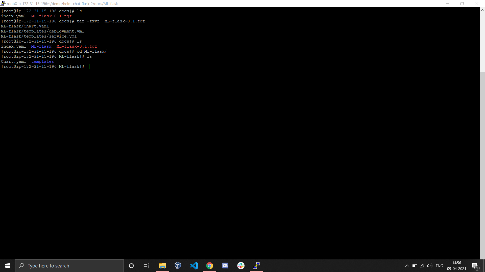
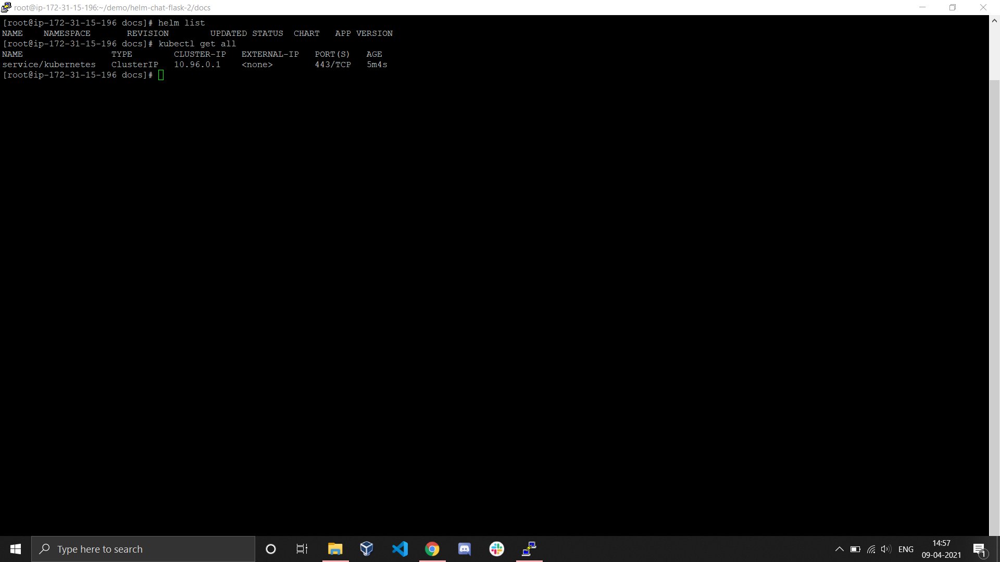
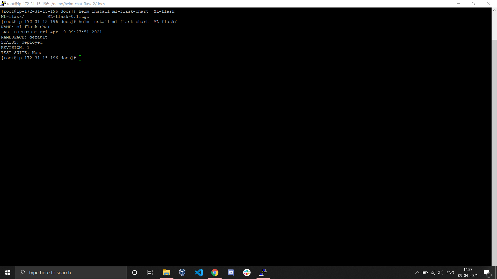
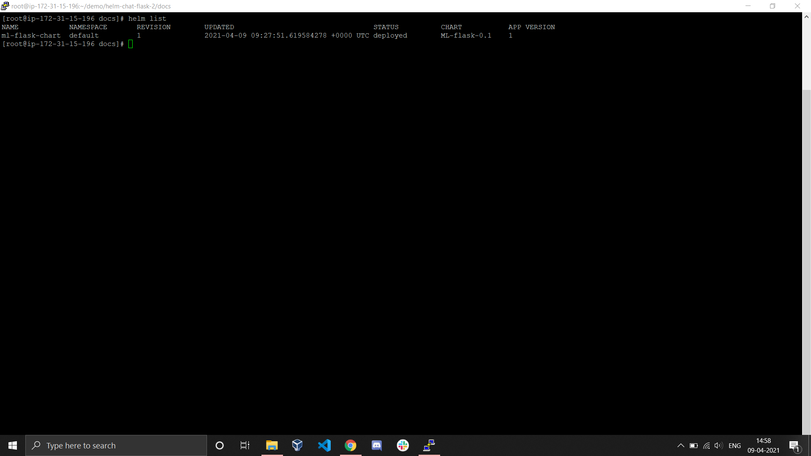

# Creating Helm Kubernetes Package

## Objective
The main objective of this project is to create a helm package which will launch the k8s resources when launched and will deploy the entire application. 

## Theory 
In kubernetes we need a lot of resources to deploy our application and get it running. Everytime we want to deploy the application we need to write the entire code. 
To solve this issue we use package manager helm. Helm is a kubernetes package manager using which we can group the resources and create a package. 
Now everytime the package is launched, all the resources are launched the entire application running on those resources is deployed. 

In this project we will deploy the diabetes detection app using k8s resources then we will create a package from these resources and will use this package to further deploy the application in other systems. 

## Steps

### Creating the docker image for the app
The first step of this project is creating an image using which we can deploy the app. For this we use centos:7 as our base image and load our code in the image.
We create a dockerfile which will copy the code in the image in buildtime and will start the flask server at runtime. When a container is launched using this image it will start the webserver hosting our diabetes app on container's ip and port number 80. 

*Checkout the code for webapp [here](https://github.com/ritwik-jha/diabetes-ML-flask-WA)*

*Checkout the image [here](https://hub.docker.com/repository/docker/ritwik46/flask-image)*

**image history** 


**dockerhub**


### Creating the resources manually 
Now we have the image of our app and we need to deploy the app. To deploy the app we need k8s resources. We use k8s deployment to launch the pods and k8s service to give public access to the app. 
The service uses NodePort routing in which all the request to the ip of main server and some specific port is routed to webserver running in the pods at port 80 of the pods launched by deployment. 

**deployment.yml**
```yaml
apiVersion: apps/v1
kind: Deployment
metadata:
  creationTimestamp: null
  labels:
    app: dia-ml
  name: dep1
spec:
  replicas: 3
  selector:
    matchLabels:
      app: dia-ml
  strategy: {}
  template:
    metadata:
      creationTimestamp: null
      labels:
        app: dia-ml
    spec:
      containers:
      - image: ritwik46/flask-image:v4
        name: flask-image
        resources: {}
status: {}
```

**service.yml**
```yaml
apiVersion: v1
kind: Service
metadata:
  creationTimestamp: null
  labels:
    app: dia-ml
  name: dep1
spec:
  ports:
  - port: 80
    protocol: TCP
    targetPort: 80
  selector:
    app: dia-ml
  type: NodePort
status:
  loadBalancer: {}
  ```

We can launch these resources on kubernets cluster using kubectl 
```bash
kubectl apply -f deployment.yml

kubectl apply -f service.yml
```

This will launch the entire infrastructure and the app becomes accessible. But we need to do all these steps again and again to deploy the app.

### Creating package
Now instead of launching the packages manually we create helm package. But first we have to install helm.

We install the desired helm version and then extract the tar file.
```bash
tar -zxvf helm-v3.0.0-linux-amd64.tar.gz

mv linux-amd64/helm  /usr/local/bin/helm
```

To list the installed packages
```bash
helm list
```
To create a package we create a directory and inside that directory we create a template folder where we put all the k8s resource yml code. In the directory we also create chart.yml file which stores data about the package.

**Breakdown**
```
flask-chart:
|
|---Chart.yml
|
|---templates:
     |
     |----deployment.yml
     |
     |----service.yml
```

Now we create the chart from this directory
```
helm create flask-chart/
```


Now the chart is created we pack the chart 
```
helm package flask-chart/
```
**This will pack the chart and store in a compressed tgz file**


**Now we can host this on github and upload in artifact hub but for this we also need to create an index file**

### Using the package to deploy the application

First we download the package from artifact hub.


We first unpack the package
```
tar -zxvf package_name.tgz
```

This unpacks into directory containing chart.yml file and templates folder.



Before installing the chart we check the installed charts and the laucnhed k8s resources.
```
helm list

kubectl list all --all
```



To install the package
```
helm install chart_name  chart_directory/
```



Now checking the installed packages and the running resources.




We see that the service routes all the requests on ip of server and port number 32277 to port number 80 of the running pods. 

Let's try to access this route


WOW! the app is working just fine.
So we conclude that the setup is up and running without any errors. 
